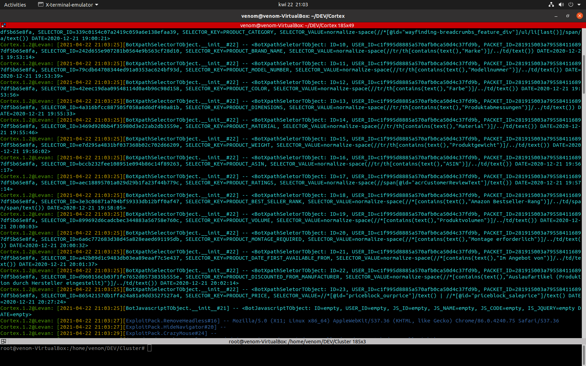

## Cortex

 Cortex is a chromium based web scrapper which is undetectable for most of
anti scrapping software's, generally it can be used for any type of activities in data collection 
direction. For example with Cortex we can parse all the products from the Amazon, or count
how many time some specific product was sold and etc.

#### Requirements
Google Chrome v 86

##### Features
- [+] XPATH, CSS PARSER
- [+] ANTI SELENIUM DETECTOR
- [+] TOR Support
- [+] HTTP proxy support
- [+] Anti captcha
- [+] Multithreading support
- [+] In action javascript payload executor
- [+] Fast data parser
- [+] Can be used with Cluster (Data segregation software)

##### Vendors
- [+] AMAZON
- [+] Ebay
- [+] Aliexpress
- [+] Allegro

